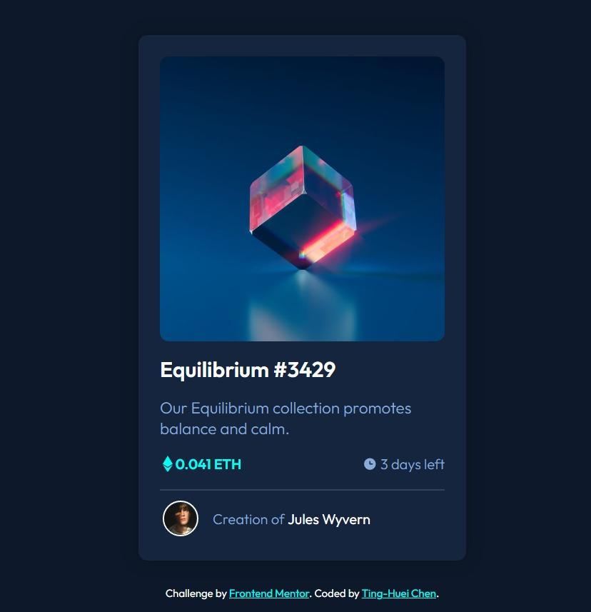

# Frontend Mentor - NFT preview card component solution

This is a solution to the [NFT preview card component challenge on Frontend Mentor](https://www.frontendmentor.io/challenges/nft-preview-card-component-SbdUL_w0U). Frontend Mentor challenges help you improve your coding skills by building realistic projects.

## Table of contents

- [Overview](#overview)
  - [The challenge](#the-challenge)
  - [Screenshot](#screenshot)
  - [Links](#links)
- [My process](#my-process)
  - [Built with](#built-with)
  - [What I learned](#what-i-learned)
  - [Continued development](#continued-development)
  - [Useful resources](#useful-resources)
- [Author](#author)

## Overview

### The challenge

This challenge is to build out this preview card component and get it looking as close to the design as possible.

Users should be able to:

- View the optimal layout depending on their device's screen size
- See hover states for interactive elements

### Screenshot



### Links

- Solution URL: https://hejkeikei.github.io/nft-preview-card-component-main/

## My process

- Write with semantic markup.
- Place all the images and fill in the alt attrubute.
- Set all root figures and font.
- Plan the layout.
- Write CSS for general tags.
- Write classes' and ids' style.
- Done hover state.
- Get all CSS done, check on both desktop and mobile.
- Go through validators.

### Built with

- Semantic HTML5 markup
- CSS custom properties
- Flexbox

### What I learned

- background shorthand

```css
#overlay:hover {
  background: var(--cyanOp) url(images/icon-view.svg) no-repeat center;
}
```

- I reviewed the position property of CSS

```html
<figure class="imgBox">
  
  <figcaption id="overlay"></figcaption>
</figure>
```

```css
.imgBox {
  position: relative;
  width: 100%;
  height: 0;
  border-radius: 10px;
  padding-bottom: 100%;
  background-color: var(--cyan);
  overflow: hidden;
}
#overlay {
  position: absolute;
  top: 0;
  left: 0;
  width: 100%;
  height: 100%;
}
```

### Continued development

- Click and zoom image
- Array of card components

### Useful resources

- [CSS Positioning](https://developer.mozilla.org/en-US/docs/Learn/CSS/CSS_layout/Positioning).

## Author

- Codepen - [TingHueiChen](https://codepen.io/TingHueiChen)
- Frontend Mentor - [@hejkeikei](https://www.frontendmentor.io/profile/hejkeikei)
- Twitter - [@hej_keikei](https://twitter.com/hej_keikei)
